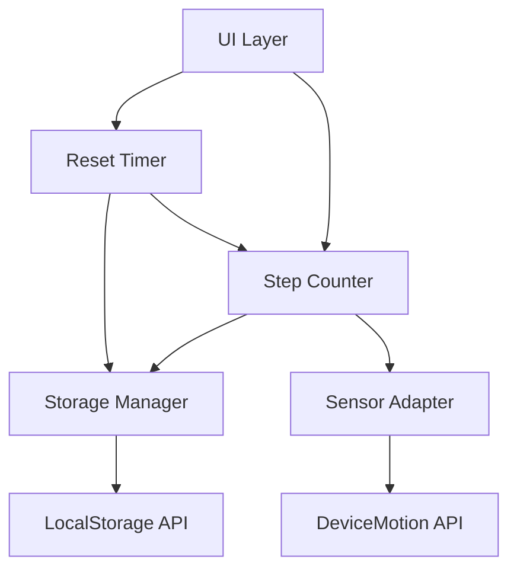

# 設計書：歩数計アプリ

## 概要

本設計書は、HTML、CSS、JavaScriptを使用したスマートフォン向け歩数計アプリケーションの技術設計を定義します。このアプリケーションは、デバイスの加速度センサーを利用して歩数を自動的にカウントし、ユーザーが設定可能な24時間周期で自動リセットする機能を提供します。

### 主要な設計決定

1. **完全なクライアントサイド実装**: サーバーを必要とせず、すべての処理をブラウザ内で完結
2. **Web APIs の活用**: DeviceMotion API（加速度センサー）とLocal Storage API（データ永続化）を使用
3. **シングルページアプリケーション**: ページ遷移なしで動作するシンプルなUI
4. **イベント駆動アーキテクチャ**: センサーイベントとタイマーイベントに基づく処理

## アーキテクチャ

### システム構成図



### レイヤー構成

1. **UI Layer（UIレイヤー）**: ユーザーインターフェースの表示と操作
2. **Business Logic Layer（ビジネスロジックレイヤー）**: 歩数カウント、リセット管理
3. **Data Access Layer（データアクセスレイヤー）**: ローカルストレージへのアクセス
4. **Sensor Layer（センサーレイヤー）**: デバイスセンサーとの通信

## コンポーネントとインターフェース

### 1. StepCounter（歩数カウンター）

歩数の計測とカウント管理を担当するコアコンポーネント。

```javascript
class StepCounter {
  constructor(storageManager, sensorAdapter) {
    this.currentSteps = 0;
    this.storageManager = storageManager;
    this.sensorAdapter = sensorAdapter;
    this.lastAcceleration = null;
    this.stepThreshold = 1.2; // 歩数として認識する加速度の閾値
  }

  // 初期化：保存されたデータを読み込む
  async initialize() {
    const savedData = await this.storageManager.loadStepData();
    if (savedData && this.isCurrentPeriod(savedData.timestamp)) {
      this.currentSteps = savedData.steps;
    } else {
      this.currentSteps = 0;
    }
    this.sensorAdapter.startListening(this.onMotionDetected.bind(this));
  }

  // 動きを検出したときの処理
  onMotionDetected(acceleration) {
    if (this.isStep(acceleration)) {
      this.incrementStep();
    }
  }

  // 歩数として認識するかの判定
  isStep(acceleration) {
    // 加速度の変化量を計算
    const magnitude = Math.sqrt(
      acceleration.x ** 2 + 
      acceleration.y ** 2 + 
      acceleration.z ** 2
    );
    
    // 閾値を超えているか確認
    return magnitude > this.stepThreshold;
  }

  // 歩数を増やす
  incrementStep() {
    this.currentSteps++;
    this.storageManager.saveStepData({
      steps: this.currentSteps,
      timestamp: Date.now()
    });
    this.notifyObservers();
  }

  // 歩数をリセット
  reset() {
    this.currentSteps = 0;
    this.storageManager.saveStepData({
      steps: 0,
      timestamp: Date.now()
    });
    this.notifyObservers();
  }

  // 現在の歩数を取得
  getCurrentSteps() {
    return this.currentSteps;
  }

  // 現在の日次期間内かを確認
  isCurrentPeriod(timestamp) {
    const resetTime = this.storageManager.getResetTime();
    const lastReset = this.calculateLastResetTime(resetTime);
    return timestamp >= lastReset;
  }
}
```

### 2. ResetTimer（リセットタイマー）

24時間周期でのリセットを管理するコンポーネント。

```javascript
class ResetTimer {
  constructor(stepCounter, storageManager) {
    this.stepCounter = stepCounter;
    this.storageManager = storageManager;
    this.timerId = null;
  }

  // タイマーを開始
  start() {
    const resetTime = this.storageManager.getResetTime();
    const nextReset = this.calculateNextResetTime(resetTime);
    const now = Date.now();
    
    // 既にリセット時刻を過ぎている場合は即座にリセット
    if (now >= nextReset) {
      this.executeReset();
    }
    
    // 次のリセットまでの時間を計算
    const timeUntilReset = nextReset - now;
    this.scheduleReset(timeUntilReset);
  }

  // リセットをスケジュール
  scheduleReset(milliseconds) {
    if (this.timerId) {
      clearTimeout(this.timerId);
    }
    
    this.timerId = setTimeout(() => {
      this.executeReset();
      // 次の24時間後にリセットをスケジュール
      this.scheduleReset(24 * 60 * 60 * 1000);
    }, milliseconds);
  }

  // リセットを実行
  executeReset() {
    // 現在の歩数を履歴として保存
    const currentSteps = this.stepCounter.getCurrentSteps();
    this.storageManager.saveHistory({
      steps: currentSteps,
      date: new Date().toISOString()
    });
    
    // 歩数をリセット
    this.stepCounter.reset();
  }

  // 次のリセット時刻を計算
  calculateNextResetTime(resetTime) {
    const now = new Date();
    const [hours, minutes] = resetTime.split(':').map(Number);
    
    const nextReset = new Date();
    nextReset.setHours(hours, minutes, 0, 0);
    
    // 既に今日のリセット時刻を過ぎている場合は明日に設定
    if (nextReset <= now) {
      nextReset.setDate(nextReset.getDate() + 1);
    }
    
    return nextReset.getTime();
  }

  // リセット時刻を更新
  updateResetTime(newResetTime) {
    this.storageManager.setResetTime(newResetTime);
    this.start(); // タイマーを再スケジュール
  }
}
```

### 3. StorageManager（ストレージマネージャー）

ローカルストレージへのデータ保存と読み込みを管理するコンポーネント。

```javascript
class StorageManager {
  constructor() {
    this.KEYS = {
      STEP_DATA: 'stepCounter_currentData',
      RESET_TIME: 'stepCounter_resetTime',
      HISTORY: 'stepCounter_history'
    };
    this.DEFAULT_RESET_TIME = '00:00'; // デフォルトは午前0時
  }

  // 歩数データを保存
  saveStepData(data) {
    try {
      localStorage.setItem(this.KEYS.STEP_DATA, JSON.stringify(data));
      return true;
    } catch (error) {
      console.error('Failed to save step data:', error);
      return false;
    }
  }

  // 歩数データを読み込み
  loadStepData() {
    try {
      const data = localStorage.getItem(this.KEYS.STEP_DATA);
      return data ? JSON.parse(data) : null;
    } catch (error) {
      console.error('Failed to load step data:', error);
      return null;
    }
  }

  // リセット時刻を取得
  getResetTime() {
    try {
      const resetTime = localStorage.getItem(this.KEYS.RESET_TIME);
      return resetTime || this.DEFAULT_RESET_TIME;
    } catch (error) {
      console.error('Failed to get reset time:', error);
      return this.DEFAULT_RESET_TIME;
    }
  }

  // リセット時刻を設定
  setResetTime(time) {
    try {
      // 時刻形式の検証（HH:MM）
      if (!/^([0-1][0-9]|2[0-3]):[0-5][0-9]$/.test(time)) {
        throw new Error('Invalid time format');
      }
      localStorage.setItem(this.KEYS.RESET_TIME, time);
      return true;
    } catch (error) {
      console.error('Failed to set reset time:', error);
      return false;
    }
  }

  // 履歴を保存
  saveHistory(entry) {
    try {
      const history = this.loadHistory();
      history.push(entry);
      // 最新30日分のみ保持
      const recentHistory = history.slice(-30);
      localStorage.setItem(this.KEYS.HISTORY, JSON.stringify(recentHistory));
      return true;
    } catch (error) {
      console.error('Failed to save history:', error);
      return false;
    }
  }

  // 履歴を読み込み
  loadHistory() {
    try {
      const history = localStorage.getItem(this.KEYS.HISTORY);
      return history ? JSON.parse(history) : [];
    } catch (error) {
      console.error('Failed to load history:', error);
      return [];
    }
  }
}
```

### 4. SensorAdapter（センサーアダプター）

デバイスの加速度センサーとの通信を担当するコンポーネント。

```javascript
class SensorAdapter {
  constructor() {
    this.isListening = false;
    this.callback = null;
  }

  // センサーの利用可否を確認
  isAvailable() {
    return 'DeviceMotionEvent' in window;
  }

  // 権限をリクエスト（iOS 13+で必要）
  async requestPermission() {
    if (typeof DeviceMotionEvent.requestPermission === 'function') {
      try {
        const permission = await DeviceMotionEvent.requestPermission();
        return permission === 'granted';
      } catch (error) {
        console.error('Permission request failed:', error);
        return false;
      }
    }
    // 権限リクエストが不要な環境
    return true;
  }

  // センサーのリスニングを開始
  async startListening(callback) {
    if (this.isListening) {
      return;
    }

    if (!this.isAvailable()) {
      throw new Error('DeviceMotion API is not available');
    }

    const hasPermission = await this.requestPermission();
    if (!hasPermission) {
      throw new Error('DeviceMotion permission denied');
    }

    this.callback = callback;
    this.isListening = true;

    window.addEventListener('devicemotion', this.handleMotion.bind(this));
  }

  // センサーのリスニングを停止
  stopListening() {
    if (!this.isListening) {
      return;
    }

    window.removeEventListener('devicemotion', this.handleMotion.bind(this));
    this.isListening = false;
    this.callback = null;
  }

  // モーションイベントを処理
  handleMotion(event) {
    if (!this.callback || !event.accelerationIncludingGravity) {
      return;
    }

    const acceleration = {
      x: event.accelerationIncludingGravity.x || 0,
      y: event.accelerationIncludingGravity.y || 0,
      z: event.accelerationIncludingGravity.z || 0
    };

    this.callback(acceleration);
  }
}
```

### 5. UIController（UIコントローラー）

ユーザーインターフェースの表示と操作を管理するコンポーネント。

```javascript
class UIController {
  constructor(stepCounter, resetTimer) {
    this.stepCounter = stepCounter;
    this.resetTimer = resetTimer;
    this.elements = {};
  }

  // UI要素を初期化
  initialize() {
    this.elements = {
      stepDisplay: document.getElementById('step-display'),
      nextResetDisplay: document.getElementById('next-reset'),
      resetTimeInput: document.getElementById('reset-time-input'),
      saveButton: document.getElementById('save-reset-time'),
      errorMessage: document.getElementById('error-message')
    };

    this.setupEventListeners();
    this.updateDisplay();
  }

  // イベントリスナーを設定
  setupEventListeners() {
    this.elements.saveButton.addEventListener('click', () => {
      this.handleResetTimeChange();
    });

    // 歩数カウンターの変更を監視
    this.stepCounter.addObserver(() => {
      this.updateDisplay();
    });
  }

  // 表示を更新
  updateDisplay() {
    // 歩数を表示
    const steps = this.stepCounter.getCurrentSteps();
    this.elements.stepDisplay.textContent = steps.toLocaleString();

    // 次のリセット時刻を表示
    const nextReset = this.resetTimer.calculateNextResetTime(
      this.resetTimer.storageManager.getResetTime()
    );
    const nextResetDate = new Date(nextReset);
    this.elements.nextResetDisplay.textContent = 
      nextResetDate.toLocaleString('ja-JP');
  }

  // リセット時刻の変更を処理
  handleResetTimeChange() {
    const newTime = this.elements.resetTimeInput.value;
    
    if (!/^([0-1][0-9]|2[0-3]):[0-5][0-9]$/.test(newTime)) {
      this.showError('有効な時刻形式（HH:MM）を入力してください');
      return;
    }

    this.resetTimer.updateResetTime(newTime);
    this.updateDisplay();
    this.showSuccess('リセット時刻を更新しました');
  }

  // エラーメッセージを表示
  showError(message) {
    this.elements.errorMessage.textContent = message;
    this.elements.errorMessage.className = 'error';
    setTimeout(() => {
      this.elements.errorMessage.textContent = '';
    }, 3000);
  }

  // 成功メッセージを表示
  showSuccess(message) {
    this.elements.errorMessage.textContent = message;
    this.elements.errorMessage.className = 'success';
    setTimeout(() => {
      this.elements.errorMessage.textContent = '';
    }, 3000);
  }
}
```

## データモデル

### StepData（歩数データ）

現在の歩数情報を表すデータ構造。

```javascript
{
  steps: Number,        // 現在の歩数（0以上の整数）
  timestamp: Number     // 最終更新時刻（Unix時間ミリ秒）
}
```

### HistoryEntry（履歴エントリ）

過去の歩数記録を表すデータ構造。

```javascript
{
  steps: Number,        // その日の歩数（0以上の整数）
  date: String          // 日付（ISO 8601形式）
}
```

### AccelerationData（加速度データ）

センサーから取得した加速度情報を表すデータ構造。

```javascript
{
  x: Number,           // X軸の加速度（m/s²）
  y: Number,           // Y軸の加速度（m/s²）
  z: Number            // Z軸の加速度（m/s²）
}
```

### ResetTimeConfig（リセット時刻設定）

リセット時刻の設定を表すデータ構造。

```javascript
{
  time: String         // リセット時刻（HH:MM形式、例: "06:00"）
}
```


## 正確性プロパティ

プロパティとは、システムのすべての有効な実行において真であるべき特性や動作のことです。プロパティは、人間が読める仕様と機械で検証可能な正確性保証との橋渡しとなります。

### プロパティ1: 加速度閾値による歩数カウント

*任意の*加速度データに対して、その大きさが閾値を超える場合にのみ歩数がカウントされるべきである

**検証: 要件 1.1**

### プロパティ2: UI表示の同期

*任意の*歩数の変更に対して、UI要素は更新された歩数を正確に表示するべきである

**検証: 要件 1.2, 5.4**

### プロパティ3: 歩数データのラウンドトリップ

*任意の*歩数データ（歩数とタイムスタンプ）に対して、保存してから読み込むと同等のデータが返されるべきである

**検証: 要件 2.1, 2.3**

### プロパティ4: リセット時刻のラウンドトリップ

*任意の*有効なリセット時刻（HH:MM形式）に対して、保存してから読み込むと同じ時刻が返されるべきである

**検証: 要件 2.4, 4.3**

### プロパティ5: リセットによる歩数の初期化

*任意の*歩数に対して、リセットを実行すると歩数が0になるべきである

**検証: 要件 3.1**

### プロパティ6: リセット時の履歴保存

*任意の*歩数に対して、リセットを実行するとその歩数が履歴に保存されるべきである

**検証: 要件 3.2**

### プロパティ7: 次回リセット時刻の計算

*任意の*リセット時刻に対して、次回リセット時刻は正確に24時間後に計算されるべきである

**検証: 要件 3.3, 4.4**

### プロパティ8: 時刻形式の検証

*任意の*文字列に対して、有効な時刻形式（HH:MM、00:00〜23:59）のみが受け入れられ、無効な形式は拒否されるべきである

**検証: 要件 4.2**

### プロパティ9: 次回リセット時刻の表示

*任意の*リセット時刻設定に対して、UI要素は正しく計算された次回リセット時刻を表示するべきである

**検証: 要件 5.2**

### プロパティ10: 歩数の非負性

*任意の*操作（初期化、増加、リセット）の後、歩数は常に0以上であるべきである

**検証: 要件 6.1**

### プロパティ11: タイムスタンプの検証

*任意の*保存されたデータに対して、そのタイムスタンプが現在の日次期間内にあるかどうかが正しく判定されるべきである

**検証: 要件 6.3**

## エラーハンドリング

### センサー関連のエラー

1. **センサー利用不可**: DeviceMotion APIが利用できない場合
   - エラーメッセージを表示
   - 手動カウント機能にフォールバック
   - ユーザーに代替手段を提供

2. **権限拒否**: センサーへのアクセス権限が拒否された場合
   - 明確なエラーメッセージを表示
   - 権限の必要性を説明
   - 手動カウント機能を提供

### ストレージ関連のエラー

1. **読み込み失敗**: ローカルストレージからのデータ読み込みに失敗した場合
   - デフォルト値（0歩、デフォルトリセット時刻）で初期化
   - エラーをコンソールに記録
   - ユーザーには通常通り動作

2. **書き込み失敗**: ローカルストレージへのデータ保存に失敗した場合
   - エラーメッセージを表示
   - メモリ内でデータを保持（セッション中は有効）
   - 次回の保存を試行

3. **ストレージ容量不足**: ローカルストレージの容量が不足している場合
   - 古い履歴データを削除（最新30日分のみ保持）
   - 再度保存を試行
   - 失敗した場合はユーザーに通知

### データ整合性のエラー

1. **無効なデータ形式**: 保存されたデータが期待される形式でない場合
   - データを破棄
   - デフォルト値で初期化
   - エラーをコンソールに記録

2. **古いデータ**: 保存されたデータが現在の日次期間外の場合
   - 古いデータを履歴に移動
   - 新しい日次期間として初期化（0歩）
   - 次回リセット時刻を再計算

### UI関連のエラー

1. **DOM要素が見つからない**: 必要なUI要素が存在しない場合
   - エラーをコンソールに記録
   - 可能な範囲で機能を継続
   - 重要な要素が欠けている場合は初期化エラーを表示

2. **無効な入力**: ユーザーが無効なリセット時刻を入力した場合
   - 入力フィールドをハイライト
   - 具体的なエラーメッセージを表示
   - 有効な形式の例を提示

## テスト戦略

### デュアルテストアプローチ

本アプリケーションでは、包括的なテストカバレッジを実現するために、ユニットテストとプロパティベーステストの両方を使用します。

- **ユニットテスト**: 特定の例、エッジケース、エラー条件を検証
- **プロパティベーステスト**: すべての入力にわたる普遍的なプロパティを検証

両者は補完的であり、包括的なカバレッジに必要です。ユニットテストは具体的なバグを捕捉し、プロパティテストは一般的な正確性を検証します。

### プロパティベーステスト

JavaScriptのプロパティベーステストには**fast-check**ライブラリを使用します。

**設定要件:**
- 各プロパティテストは最低100回の反復を実行
- 各テストは設計書のプロパティを参照するタグを含む
- タグ形式: `// Feature: step-counter-app, Property N: [プロパティテキスト]`

**テスト対象のプロパティ:**
1. 加速度閾値による歩数カウント（プロパティ1）
2. UI表示の同期（プロパティ2）
3. 歩数データのラウンドトリップ（プロパティ3）
4. リセット時刻のラウンドトリップ（プロパティ4）
5. リセットによる歩数の初期化（プロパティ5）
6. リセット時の履歴保存（プロパティ6）
7. 次回リセット時刻の計算（プロパティ7）
8. 時刻形式の検証（プロパティ8）
9. 次回リセット時刻の表示（プロパティ9）
10. 歩数の非負性（プロパティ10）
11. タイムスタンプの検証（プロパティ11）

### ユニットテスト

ユニットテストは特定の例とエッジケースに焦点を当てます。プロパティテストが多くの入力をカバーするため、ユニットテストは以下に限定します：

**テスト対象:**
- センサー権限のリクエスト（要件1.3）
- センサーアクセス拒否時の処理（要件1.4, 7.1）
- アプリ起動時のデータ読み込み（要件2.2）
- リセット時刻設定UIの存在（要件4.1）
- 設定画面の存在（要件5.3）
- データ読み込み失敗時のデフォルト値初期化（要件6.2）
- 古いデータでの初期化時のリセット（要件3.4, 6.4）
- ストレージアクセス失敗時の処理（要件7.2）

**統合テスト:**
- コンポーネント間の連携
- エンドツーエンドのフロー（歩数カウント→保存→リセット）
- エラー発生時のシステム全体の動作

### テストツール

- **テストフレームワーク**: Jest
- **プロパティベーステスト**: fast-check
- **DOM操作のモック**: jsdom
- **センサーAPIのモック**: カスタムモック実装

### テストカバレッジ目標

- コードカバレッジ: 80%以上
- すべての正確性プロパティがプロパティテストでカバーされる
- すべてのエラーハンドリングパスがユニットテストでカバーされる
- 主要なユーザーフローが統合テストでカバーされる
